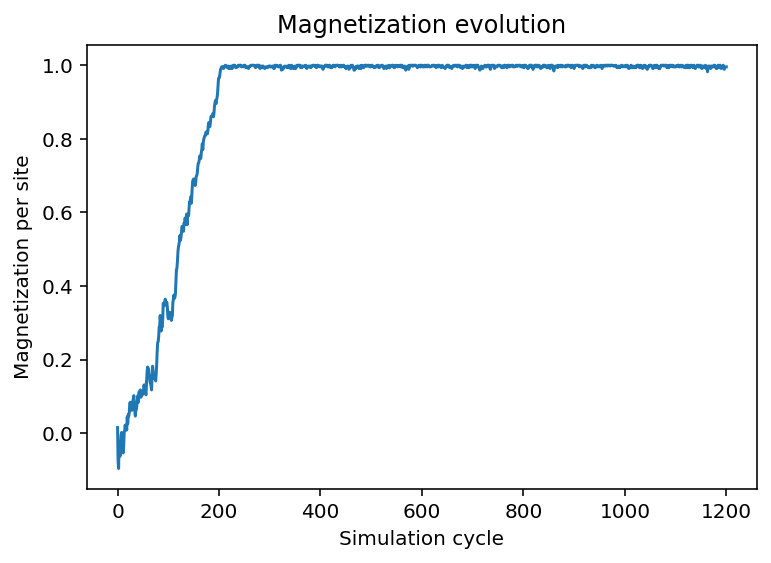
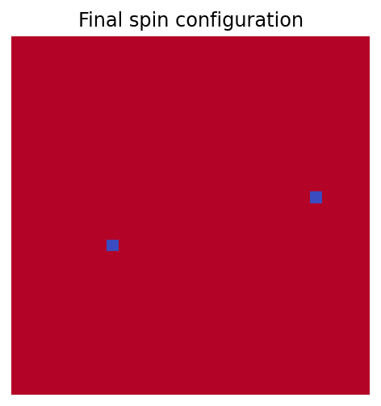

# 2D Ising Model Monte Carlo Simulation

Monte Carlo simulation of the two-dimensional Ising model on a square lattice using the Metropolis algorithm.

The project supports both single-temperature simulations and temperature sweeps, together with statistical analysis, comparison with exact analytical results, data storage, reproducible random-number generation, and plotting of saved simulations.

## Features

- 2D square Ising lattice with periodic boundary conditions
- Metropolis Monte Carlo dynamics
- Single-temperature simulations
- Temperature sweeps with independent repetitions
- Magnetization measurements and statistical uncertainties
- Energy calculated from final configurations
- Comparison with exact thermodynamic-limit results
- Saving and reloading simulation results
- Reproducible simulations through explicit random seeds
- Automated tests with `pytest`

---

# Physical model

The zero-field two-dimensional Ising model is defined by the Hamiltonian

```math
H = -J \sum_{\langle i,j \rangle} s_i s_j
```

where:

- `s_i = ±1` is the spin at lattice site `i`;
- `J` is the nearest-neighbor coupling;
- the sum runs over nearest-neighbor pairs.

The simulations use periodic boundary conditions. Spins at the edge of the lattice therefore interact with spins on the opposite edge, removing physical boundaries from the system.

The calculations use units in which

```math
k_B = 1.
```

For a ferromagnetic system, `J > 0`, neighboring spins energetically favor alignment.

The exact critical temperature of the infinite square-lattice Ising model is

```math
T_c =
\frac{2J}
{\ln(1+\sqrt{2})}.
```

For `J = 1`,

```math
T_c \approx 2.269.
```

## Metropolis dynamics

The system is evolved using the Metropolis Monte Carlo algorithm.

At every attempted update, one lattice site is selected randomly and its spin is proposed to flip:

```math
s_i \rightarrow -s_i.
```

Only the interaction between this spin and its four nearest neighbors changes. The corresponding energy difference is therefore

```math
\Delta E =
2J s_i
\sum_{j \in \mathrm{nn}(i)} s_j.
```

The proposed flip is accepted with probability

```math
P_{\mathrm{accept}} =
\begin{cases}
1, & \Delta E \leq 0, \\
e^{-\Delta E/T}, & \Delta E > 0.
\end{cases}
```

Energy-lowering moves are always accepted.

Energy-increasing moves can still be accepted because of thermal fluctuations, but their probability decreases exponentially with the energy cost of the move.

At low temperature, energetically unfavorable moves are strongly suppressed and the system tends toward ordered configurations.

At high temperature, thermal fluctuations make spin flips more frequent and destroy long-range magnetic order.

One Monte Carlo cycle in this project corresponds to

```math
L^2
```

attempted spin flips, where `L` is the linear lattice size.

A cycle therefore corresponds, on average, to one attempted update per lattice site.

---

# Results

The program can be used either to study the time evolution of a system at one fixed temperature or to investigate its behavior over a range of temperatures.

## Single-temperature simulation

A single simulation can record the magnetization during the Monte Carlo evolution.



The final spin configuration can also be visualized directly.



The magnetization history makes it possible to observe the equilibration process and the fluctuations around the equilibrium state.

The lattice plot provides a direct visualization of the magnetic domains present in the final configuration.

## Temperature sweep

The multi-run simulation performs independent simulations over a range of temperatures.

The main magnetic observable is the absolute magnetization per site:

```math
|m| =
\left|
\frac{1}{N}
\sum_i s_i
\right|.
```

The numerical results are compared with the exact spontaneous magnetization of the infinite two-dimensional Ising model.


The transition between the ordered and disordered phases occurs around the exact critical temperature.

For a finite lattice, the measured mean absolute magnetization does not become exactly zero above the critical temperature.

Even in the disordered phase, instantaneous fluctuations generally produce a small non-zero total magnetization. Since the quantity used in the analysis is the absolute magnetization, positive and negative fluctuations do not cancel each other.

Therefore, for a finite system,

```math
\langle |m| \rangle > 0
```

can still be observed above the critical temperature.

The exact theoretical curve instead describes the thermodynamic limit

```math
L \rightarrow \infty,
```

where the spontaneous magnetization is zero at and above the critical temperature.

Finite-size effects are particularly visible close to the phase transition, where the correlation length becomes large compared with the lattice size.

The energy per site is also calculated from the final configurations and compared with the exact thermodynamic-limit result.


In the current implementation, energy is evaluated only from the final configuration of each independent simulation.

The values obtained from the independent repetitions are averaged at each temperature, but no statistical error bar is reported because a complete energy time series is not measured.

---

# Using the code

The programs should be run from the root directory of the repository.

Simulation parameters are stored in TOML configuration files inside the `configs/` directory.

## Single-temperature simulation

Single-temperature simulations use

```text
configs/single_run_parameters.toml
```

A typical configuration has the following structure:

```toml
[physics]
lattice_size = 30
coupling = 1.0
temperature = 2.0

[simulation]
equilibration_cycles = 500
measurement_cycles = 1000
seed = 42

[output]
record_time_series = true
sample_every = 1
save_results = true
```

### Single-run parameters

`lattice_size`

Linear size `L` of the square lattice. The total number of spins is `L x L`.

`coupling`

Nearest-neighbor interaction strength `J`.

`temperature`

Temperature at which the simulation is performed.

`equilibration_cycles`

Number of Monte Carlo cycles performed before the measurement phase.

These cycles allow the system to approach equilibrium before the part of the simulation that is considered for measurements.

`measurement_cycles`

Number of Monte Carlo cycles performed after equilibration.

`seed`

Seed used by the NumPy random-number generator.

Using an explicit seed makes the simulation reproducible.

`record_time_series`

If `true`, the magnetization is recorded during the Monte Carlo evolution.

`sample_every`

Number of Monte Carlo cycles between two stored time-series samples.

For example,

```toml
sample_every = 5
```

stores one magnetization value every five Monte Carlo cycles.

`save_results`

If `true`, the numerical results and a copy of the configuration are saved.

### Running a single simulation

Run:

```bash
python launch_single_sim.py
```

The program reads the parameters from `single_run_parameters.toml`, runs the simulation and displays the magnetization history and final lattice.

If

```toml
save_results = true
```

a new directory is created inside `results/`:

```text
results/single_run_YYYYMMDD_HHMMSS/
```

The saved run contains the numerical data and a copy of the configuration used to produce them.

### Plotting a saved single simulation

A saved simulation can be plotted again without rerunning the Monte Carlo calculation.

To plot the most recently saved single run:

```bash
python plot_single_sim.py
```

No result directory needs to be specified.

A particular saved run can instead be selected by passing its directory name:

```bash
python plot_single_sim.py single_run_YYYYMMDD_HHMMSS
```

For example:

```bash
python plot_single_sim.py single_run_20260918_193500
```

The script loads the stored magnetization history and final lattice and reproduces the corresponding plots.

The script can also be executed directly from an IDE such as Spyder. When no run is explicitly specified, the most recently saved single run is selected automatically.

---

## Temperature sweep

Temperature sweeps use

```text
configs/multi_run_parameters.toml
```

A typical configuration has the following structure:

```toml
[physics]
lattice_size = 30
coupling = 1.0

[simulation]
equilibration_cycles = 2000
measurement_cycles = 1500
measurement_every = 5
seed = 42
repetitions = 4

[temperature_sweep]
start = 1.0
stop = 3.5
points = 31
include_critical_temperature = true

[output]
record_time_series = false
sample_every = 1
save_results = true
```

### Multi-run parameters

The following physical parameters have the same meaning as in the single-temperature simulation:

`lattice_size`

Linear lattice size.

`coupling`

Nearest-neighbor interaction strength.

The simulation-specific parameters are:

`equilibration_cycles`

Number of Monte Carlo cycles performed before measurements begin.

`measurement_cycles`

Number of Monte Carlo cycles in the measurement phase.

`measurement_every`

Number of Monte Carlo cycles between two magnetization measurements used for statistical analysis.

For example,

```toml
measurement_every = 5
```

means that one statistical magnetization measurement is taken every five cycles during the measurement phase.

`seed`

Base random seed.

A different deterministic seed is generated from this value for every temperature and repetition.

`repetitions`

Number of independent simulations performed at each temperature.

Independent repetitions provide separate Monte Carlo trajectories and allow fluctuations between different runs to be included in the statistical analysis.

The temperature-sweep parameters are:

`start`

Lowest temperature in the sweep.

`stop`

Highest temperature in the sweep.

`points`

Number of equally spaced temperatures initially generated between `start` and `stop`.

`include_critical_temperature`

If `true`, the exact critical temperature is also included in the temperature grid.

This ensures that the simulation explicitly contains a point at the phase transition even when it is not one of the equally spaced temperatures.

The output parameters are:

`record_time_series`

Controls whether the ordinary magnetization time series is also generated during the individual simulations.

For the standard temperature sweep this is normally set to `false`, because the statistical magnetization measurements are collected separately.

`sample_every`

Sampling interval for the optional time series.

`save_results`

If `true`, the raw multi-run results and the configuration used to generate them are saved.

### Running a temperature sweep

Run:

```bash
python launch_multi_sim.py
```

The program performs the complete temperature sweep.

For each temperature, several independent simulations are run according to the value of `repetitions`.

After the simulations are complete, the program performs the statistical analysis and displays the magnetization and energy plots.

If saving is enabled, the output is stored in a directory similar to

```text
results/multi_run_YYYYMMDD_HHMMSS/
```

Each saved multi-run contains:

```text
data.npz
parameters.toml
```

`data.npz` contains the raw numerical results.

`parameters.toml` is a copy of the exact configuration used to generate the simulation.

The saved numerical data include:

- simulated temperatures;
- random seeds;
- measurement-cycle positions;
- magnetization measurements;
- final lattice configurations.

### Analyzing a saved temperature sweep

A saved temperature sweep can be analyzed again without repeating the Monte Carlo simulations.

To analyze the most recently saved multi-run:

```bash
python analyze_multi_sim.py
```

No result directory has to be specified.

To analyze a specific saved run:

```bash
python analyze_multi_sim.py multi_run_YYYYMMDD_HHMMSS
```

For example:

```bash
python analyze_multi_sim.py multi_run_20260918_193500
```

When no directory name is provided, the program automatically selects the most recently saved multi-run.

The analysis script:

1. loads the raw saved data;
2. calculates the mean absolute magnetization;
3. estimates its statistical uncertainty;
4. calculates the energy from the saved final configurations;
5. evaluates the exact theoretical curves;
6. produces the magnetization and energy plots.

The Monte Carlo simulation itself is not repeated.

This makes it possible to modify analysis or plotting code and immediately apply the changes to previously generated simulations.

---

# How the code works

The project separates simulation, analysis, plotting, configuration and data storage into different parts.

The general workflow is

```text
configuration file
        |
        v
parameter validation
        |
        v
lattice initialization
        |
        v
Monte Carlo simulation
        |
        v
raw numerical results
        |
        +------> optional saving
        |
        v
analysis
        |
        v
plotting
```

## Simulation engine

The Monte Carlo engine is implemented in

```text
ising_simulation.py
```

The simulation is divided into two phases.

### Equilibration phase

The system first evolves for a specified number of `equilibration_cycles`.

The purpose of this phase is to allow the lattice to approach thermal equilibrium before statistical measurements are collected.

### Measurement phase

After equilibration, the simulation continues for `measurement_cycles`.

During a multi-run simulation, the magnetization is sampled every `measurement_every` cycles.

This produces a time series of equilibrium measurements for each independent simulation.

## Single-run workflow

The single-run workflow is approximately

```text
single_run_parameters.toml
        |
        v
launch_single_sim.py
        |
        v
ising_simulation.py
        |
        +------> storage.py
        |
        v
plotter.py
```

`launch_single_sim.py` loads and validates the configuration, initializes the random-number generator and lattice, and calls the simulation engine.

If saving is enabled, `storage.py` stores the raw results.

The resulting magnetization history and final lattice are then passed to `plotter.py`.

A previously saved simulation can instead be loaded directly by `plot_single_sim.py`.

## Multi-run workflow

The multi-run workflow is approximately

```text
multi_run_parameters.toml
        |
        v
launch_multi_sim.py
        |
        v
multiple independent simulations
        |
        v
raw multi-run results
        |
        +------> storage.py
        |
        v
analysis.py
        |
        v
plotter.py
```

For every temperature and every repetition, the program creates an independent simulation.

The resulting raw data are organized by temperature and repetition.

The magnetization measurements therefore have the general structure

```text
temperature x repetition x measurement
```

while the final lattices have the structure

```text
temperature x repetition x L x L
```

These raw data can be saved and later loaded by `analyze_multi_sim.py`.

## Analysis

Numerical and physical analysis functions are contained in

```text
analysis.py
```

This module includes the calculation of:

- autocorrelation factors;
- magnetization statistics;
- statistical uncertainty;
- exact spontaneous magnetization;
- energy per site;
- mean energy from final configurations;
- exact thermodynamic-limit energy.

The analysis functions operate on numerical data and do not perform simulation or plotting.

## Plotting

All plotting functions are contained in

```text
plotter.py
```

Plotting is kept separate from numerical analysis so that calculations and visualization can be modified independently.

## Storage

Saving and loading functions are contained in

```text
storage.py
```

Simulation data are stored using compressed NumPy files.

The saved configuration is kept as a separate TOML file in the same result directory.

---

# Design choices

## Separation between simulation, analysis and plotting

Simulation, analysis and plotting are intentionally kept separate.

Monte Carlo simulations can be computationally expensive, while analysis and plotting are comparatively inexpensive.

Saving the raw simulation output makes it possible to change the analysis or visualization without having to repeat the simulation.

It also makes individual runs easier to inspect and reproduce.

## External configuration files

Simulation parameters are stored in TOML files instead of being hard-coded inside the Python source code.

This allows the physical and numerical parameters to be changed without modifying the program logic.

It also provides a clear record of the settings used for each calculation.

When a run is saved, a copy of its configuration file is stored together with the numerical data.

Therefore, changing the main configuration files later does not remove the information required to understand an older saved run.

## Explicit random seeds

Every simulation uses an explicit random seed.

This allows simulations to be reproduced exactly.

For temperature sweeps, the value specified in the configuration is used as a base seed.

Each temperature and repetition receives a different deterministic seed, so that the Monte Carlo trajectories are distinct while the complete simulation remains reproducible.

## Independent temperature simulations

Each temperature in a multi-run simulation is treated independently.

The final lattice obtained at one temperature is not used as the initial configuration of the next temperature.

This avoids introducing a dependence on the direction in which the temperature sweep is performed.

## Ordered initial state for temperature sweeps

Local Metropolis dynamics can become trapped for long times in metastable domain configurations at low temperature when starting from a completely random lattice.

This can produce large deviations from equilibrium, particularly when large domains are separated by domain walls that are slow to disappear.

For the temperature-sweep simulations, an ordered initial configuration is therefore used to reduce this low-temperature metastability.

The simulations at different temperatures and repetitions remain independent.

## Independent repetitions

Several independent simulations are performed at each temperature.

This provides information that cannot be obtained from a single Monte Carlo trajectory alone.

In particular, the statistical treatment can include both fluctuations within one trajectory and variations between independent repetitions.

## Magnetization sampling

Magnetization is measured repeatedly during the measurement phase rather than being calculated only from the final configuration.

Successive Monte Carlo measurements are not completely statistically independent.

The analysis therefore estimates the autocorrelation of each measurement series.

An autocorrelation factor is used to estimate an effective number of independent measurements.

The independent repetitions are then combined to obtain the final mean absolute magnetization and its uncertainty.

## Absolute magnetization

The observable used for the temperature sweep is the absolute magnetization.

In zero external magnetic field, the positive- and negative-magnetization ordered states are physically equivalent.

A finite system may fluctuate between these sectors.

If the signed magnetization were averaged directly, positive and negative values could cancel even though the system is magnetically ordered.

Using the absolute value provides a more useful finite-system measure of magnetic order.

## Energy from final configurations

The energy calculation is intentionally simpler than the magnetization analysis.

For each independent simulation, the energy per site is calculated from the final lattice configuration.

The values obtained from the repetitions are averaged at each temperature.

A complete energy time series is not currently measured.

For this reason, the energy plot does not include a statistical error estimate.

For the same reason, fluctuation-based observables such as the heat capacity are not included in the current implementation.

A statistically meaningful heat-capacity calculation would require repeated measurements of both energy and energy squared during the equilibrium measurement phase.

## Continuous theoretical curves

The exact theoretical results are evaluated on a dense temperature grid rather than only at the temperatures used by the Monte Carlo simulation.

The numerical Monte Carlo results are therefore displayed as discrete data points, while the analytical thermodynamic-limit prediction is displayed as a continuous curve.

This makes the distinction between simulation data and exact theory visually clear.

---

# Project structure

```text
.
├── configs/
│   ├── single_run_parameters.toml
│   └── multi_run_parameters.toml
├── figures/
│   ├── single_magnetization.png
│   ├── single_final_lattice.png
│   ├── magnetization_vs_temperature.png
│   └── energy_vs_temperature.png
├── results/
├── analysis.py
├── analyze_multi_sim.py
├── ising_simulation.py
├── launch_multi_sim.py
├── launch_single_sim.py
├── plot_single_sim.py
├── plotter.py
├── storage.py
└── test_simulation.py
```

The main responsibilities of the files are:

- `ising_simulation.py` — Monte Carlo simulation engine
- `analysis.py` — statistical and physical analysis
- `plotter.py` — plotting functions
- `storage.py` — saving and loading simulation results
- `launch_single_sim.py` — run a single-temperature simulation
- `launch_multi_sim.py` — run a temperature sweep
- `plot_single_sim.py` — reload and plot a saved single simulation
- `analyze_multi_sim.py` — reload, analyze and plot a saved temperature sweep
- `test_simulation.py` — automated test suite
- `configs/` — user-editable simulation parameters
- `figures/` — selected figures displayed in this README
- `results/` — saved numerical simulation results

---

# Saved results and reproducibility

Saved simulations are stored inside the `results/` directory.

Single runs use directories of the form

```text
single_run_YYYYMMDD_HHMMSS
```

while temperature sweeps use

```text
multi_run_YYYYMMDD_HHMMSS
```

The configuration used to generate a saved simulation is copied into the corresponding result directory as

```text
parameters.toml
```

This makes the saved run self-contained with respect to its simulation parameters.

The `results/` directory is normally ignored by Git so that exploratory simulations are not accidentally committed.

Selected representative results can still be explicitly added to the repository when they are intended to document the project.

---

# Tests

The automated test suite can be run from the repository root with

```bash
python -m pytest -v
```

The tests cover the main components of the project, including:

- lattice generation;
- magnetization calculation;
- spin-flip energy differences;
- simulation sampling;
- reproducibility with fixed random seeds;
- configuration validation;
- temperature-grid generation;
- multi-run output shapes;
- exact theoretical functions;
- statistical analysis;
- saving and loading simulation results.

---

# Requirements

The project requires Python 3.11 or newer.

The main Python dependencies are:

```text
numpy
matplotlib
scipy
pytest
```

The code can be run inside any Python environment containing these dependencies.