# 2D Ising Model Monte Carlo Simulation

Monte Carlo simulation of the two-dimensional Ising model on a square lattice using the Metropolis algorithm.

The project supports both single-temperature simulations and temperature sweeps, together with statistical analysis, comparison with exact analytical results, data storage, reproducible random-number generation, and plotting of previously saved simulations.

## Features

- 2D square Ising lattice with periodic boundary conditions
- Metropolis Monte Carlo dynamics
- Single-temperature simulations
- Temperature sweeps with independent repetitions
- Magnetization measurements and statistical uncertainties
- Energy calculated from final configurations
- Connected spin correlations calculated from final configurations
- Comparison with exact thermodynamic-limit results
- Saving and reloading simulation results
- Reproducible simulations through explicit random seeds
- Automated tests with `pytest`


## Contents

- [Physical model](#physical-model)
  - [Metropolis dynamics](#metropolis-dynamics)
- [Results](#results)
  - [Single-temperature simulations](#single-temperature-simulations)
  - [Temperature sweep](#temperature-sweep)
- [Using the code](#using-the-code)
  - [Using saved single-run results](#using-saved-single-run-results)
  - [Running a new single-temperature simulation](#running-a-new-single-temperature-simulation)
  - [Using saved temperature-sweep results](#using-saved-temperature-sweep-results)
  - [Running a new temperature sweep](#running-a-new-temperature-sweep)
- [How the code works](#how-the-code-works)
  - [Simulation engine](#simulation-engine)
  - [Single-run workflow](#single-run-workflow)
  - [Multi-run workflow](#multi-run-workflow)
  - [Analysis](#analysis)
  - [Plotting](#plotting)
  - [Storage](#storage)
- [Design choices](#design-choices)
  - [Separation between simulation, analysis and plotting](#separation-between-simulation-analysis-and-plotting)
  - [External configuration files](#external-configuration-files)
  - [Lightweight default configurations](#lightweight-default-configurations)
  - [Explicit random seeds](#explicit-random-seeds)
  - [Independent temperature simulations](#independent-temperature-simulations)
  - [Ordered initial state for temperature sweeps](#ordered-initial-state-for-temperature-sweeps)
  - [Independent repetitions](#independent-repetitions)
  - [Magnetization sampling](#magnetization-sampling)
  - [Absolute magnetization](#absolute-magnetization)
  - [Energy from final configurations](#energy-from-final-configurations)
  - [Continuous theoretical curves](#continuous-theoretical-curves)
- [Project structure](#project-structure)
- [Saved results and reproducibility](#saved-results-and-reproducibility)
- [Tests](#tests)
- [Requirements](#requirements)


---

# Physical model

The zero-field two-dimensional Ising model is defined by the Hamiltonian

```math
H = -J \sum_{\langle i,j \rangle} s_i s_j
```

where:

- `s_i = ±1` is the spin at lattice site `i`;
- `J` is the nearest-neighbor coupling;
- the sum runs over nearest-neighbor pairs.

The simulations use periodic boundary conditions. Spins at the edge of the lattice therefore interact with spins on the opposite edge, removing physical boundaries from the system.

The calculations use units in which

```math
k_B = 1.
```

For a ferromagnetic system, `J > 0`, neighboring spins energetically favor alignment.

The exact critical temperature of the infinite square-lattice Ising model is

```math
T_c =
\frac{2J}
{\ln(1+\sqrt{2})}.
```

For `J = 1`,

```math
T_c \approx 2.269.
```

## Metropolis dynamics

The system is evolved using the Metropolis Monte Carlo algorithm.

At every attempted update, one lattice site is selected randomly and its spin is proposed to flip:

```math
s_i \rightarrow -s_i.
```

Only the interaction between this spin and its four nearest neighbors changes. The corresponding energy difference is

```math
\Delta E =
2J s_i
\sum_{j \in \mathrm{nn}(i)} s_j.
```

The proposed flip is accepted with probability

```math
P_{\mathrm{accept}} =
\begin{cases}
1, & \Delta E \leq 0, \\
e^{-\Delta E/T}, & \Delta E > 0.
\end{cases}
```

Energy-lowering moves are always accepted.

Energy-increasing moves can still be accepted because of thermal fluctuations, but their probability decreases exponentially with the energy cost of the move.

At low temperature, energetically unfavorable moves are strongly suppressed and the system tends toward ordered configurations.

At high temperature, thermal fluctuations make spin flips more frequent and destroy long-range magnetic order.

One Monte Carlo cycle in this project corresponds to

```math
L^2
```

attempted spin flips, where `L` is the linear lattice size.

A cycle therefore corresponds, on average, to one attempted update per lattice site.

---

# Results

The program can be used either to study the evolution of a system at one fixed temperature or to investigate its behavior over a range of temperatures.

## Single-temperature simulations

Single-temperature simulations provide a direct view of how the microscopic spin configuration and the macroscopic magnetization change with temperature.

The following final configurations were obtained at four representative temperatures.

<table>
<tr>
<th>T = 1.0</th>
<th>T = 2.269</th>
<th>T = 4.0</th>
<th>T = 8.0</th>
</tr>
<tr>
<td>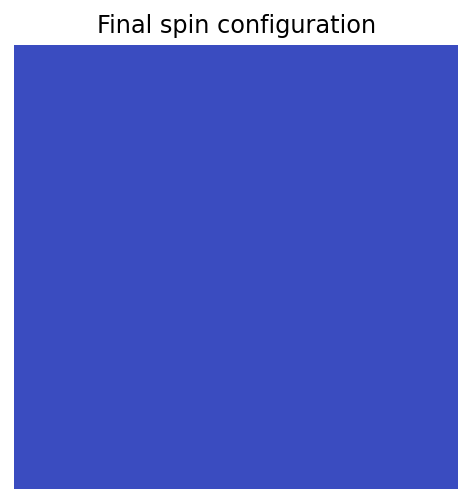</td>
<td>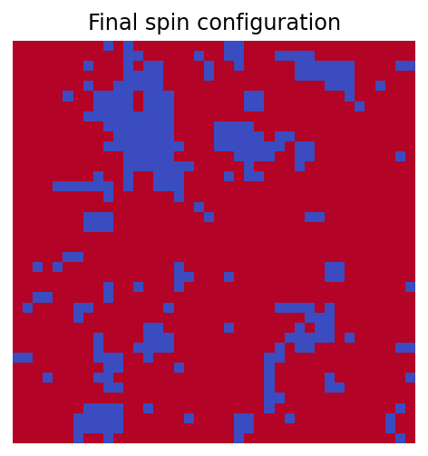</td>
<td>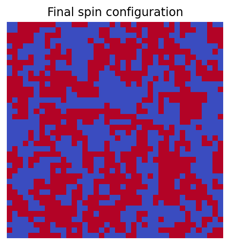</td>
<td>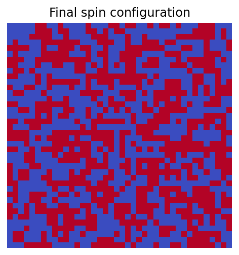</td>
</tr>
</table>

At low temperature, neighboring spins strongly favor alignment and large ordered regions dominate the lattice.

Close to the critical temperature, large correlated domains coexist with fluctuations on many spatial scales.

As the temperature is increased further above the transition, thermal fluctuations increasingly break up the ordered regions. The typical correlated domains become smaller and the lattice approaches a disordered configuration containing rapidly varying local spin orientations.

The corresponding magnetization histories are shown below.

<table>
<tr>
<th>T = 1.0</th>
<th>T = 2.269</th>
<th>T = 4.0</th>
<th>T = 8.0</th>
</tr>
<tr>
<td>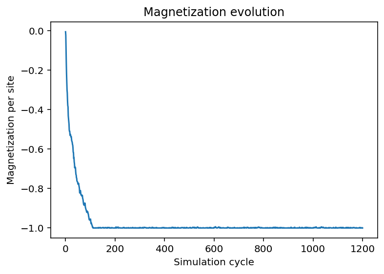</td>
<td>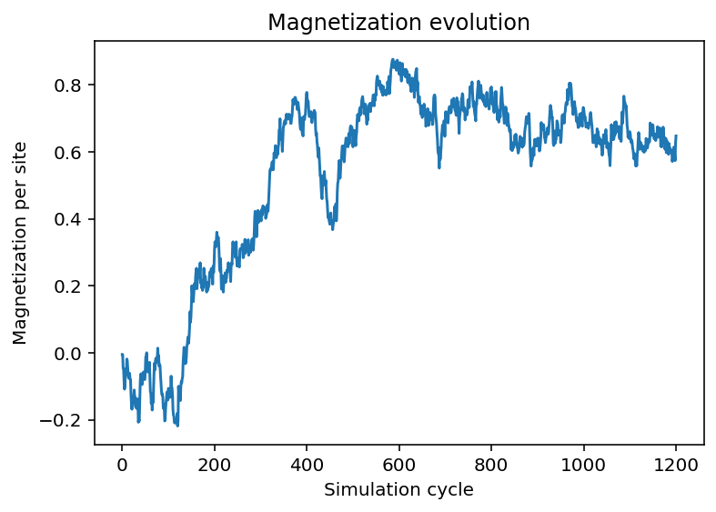</td>
<td>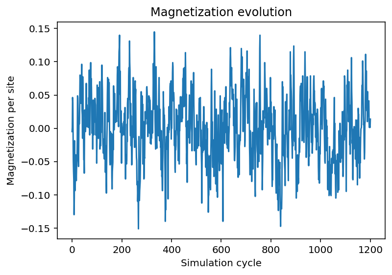</td>
<td>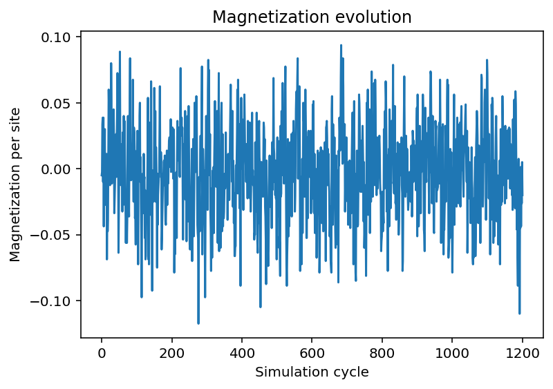</td>
</tr>
</table>

At low temperature, the system remains strongly magnetized because most spins belong to the same ordered phase.

Around the critical temperature, large fluctuations appear because correlated regions can reorganize over large length scales.

Above the transition, there is no persistent macroscopic magnetic order. The magnetization therefore fluctuates around zero. At sufficiently high temperature, these fluctuations remain confined relatively close to zero because the orientations of different spins are only weakly correlated.

These examples illustrate the connection between the microscopic lattice configurations and the corresponding macroscopic magnetization.

## Temperature sweep

The multi-run simulation performs independent simulations over a range of temperatures.

The main magnetic observable is the absolute magnetization per site:

```math
|m| =
\left|
\frac{1}{N}
\sum_i s_i
\right|.
```

The numerical results are compared with the exact spontaneous magnetization of the infinite two-dimensional Ising model.

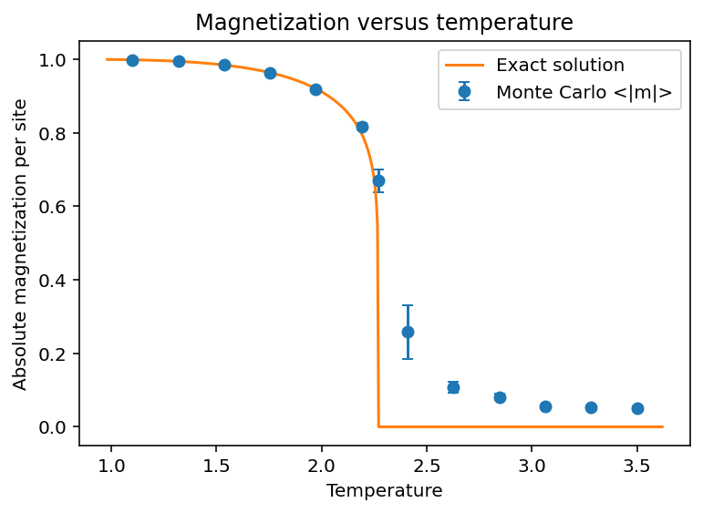

The transition between the ordered and disordered phases occurs around the exact critical temperature.

For a finite lattice, the measured mean absolute magnetization does not become exactly zero above the critical temperature.

Even in the disordered phase, instantaneous fluctuations generally produce a small non-zero total magnetization. Since the quantity used in the analysis is the absolute magnetization, positive and negative fluctuations do not cancel each other.

Therefore, for a finite system,

```math
\langle |m| \rangle > 0
```

can still be observed above the critical temperature.

The exact theoretical curve instead describes the thermodynamic limit

```math
L \rightarrow \infty,
```

where the spontaneous magnetization is zero at and above the critical temperature.

Finite-size effects are particularly visible close to the phase transition, where the correlation length becomes large compared with the lattice size.

The large correlation length near the critical temperature also contributes to the larger error bars observed in this region. As fluctuations become correlated over longer spatial and temporal scales, the system becomes more sensitive to random fluctuations. This increases both the variance within a single Monte Carlo trajectory and the variation between independent runs with different random seeds.

The energy per site is also calculated from the final configurations and compared with the exact thermodynamic-limit result.

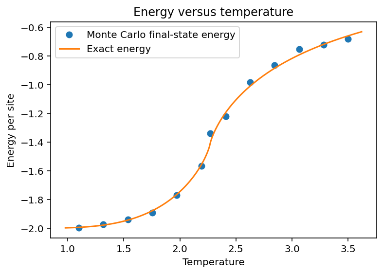

In the current implementation, energy is evaluated only from the final configuration of each independent simulation.

The values obtained from the independent repetitions are averaged at each temperature, but no statistical error bar is reported because a complete energy time series is not measured.


The final lattice configurations can also be used to study spatial correlations between spins.

The ordinary spin correlation at distance `r` is

```math
C(r) =
\langle s_i s_{i+r} \rangle.
```

However, below the critical temperature this quantity also contains the contribution of the average magnetic order.

To isolate correlations between fluctuations around the average state, the connected correlation function is used:

```math
C_{\mathrm{conn}}(r)
=
\langle s_i s_{i+r} \rangle
-
\langle s_i \rangle
\langle s_{i+r} \rangle.
```

For a translationally invariant system,

```math
\langle s_i \rangle
=
\langle s_{i+r} \rangle
=
m,
```

so that

```math
C_{\mathrm{conn}}(r)
=
C(r)-m^2.
```

Away from the critical point, the connected correlation approximately decays over a characteristic correlation length `\xi`:

```math
C_{\mathrm{conn}}(r)
\sim
e^{-r/\xi}.
```

The correlation length therefore represents the typical spatial size over which fluctuations remain correlated.

Rather than attempting to extract a full correlation length from the limited number of final configurations, the analysis evaluates the connected correlation at a single fixed distance.

The chosen distance is approximately one tenth of the lattice size:

```math
r =
\left\lfloor
\frac{L}{10}
\right\rfloor,
```

with a minimum value of one lattice site.

For example, for a lattice with `L = 40`, the correlation is evaluated at `r = 4`.

This provides a simple qualitative measure of how strongly fluctuations remain correlated over a mesoscopic distance.

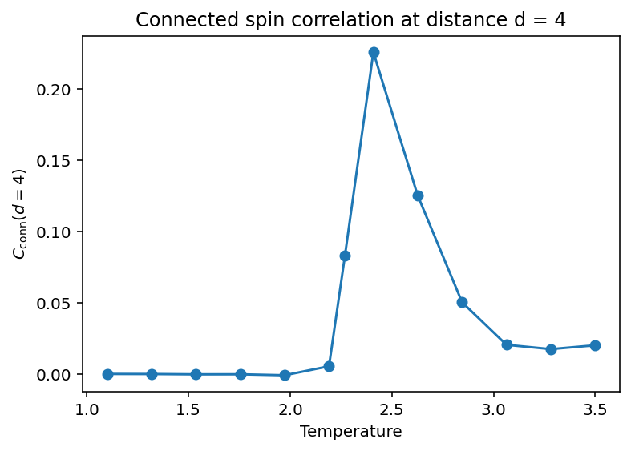

At low temperature, the system is strongly ordered and fluctuations around the ordered state are relatively small, so the connected correlation at the chosen distance is also small.

Close to the critical temperature, fluctuations become correlated over increasingly large spatial scales. The connected correlation at fixed distance therefore becomes much larger.

Above the transition, the correlation length becomes finite again and decreases as the temperature increases. The connected correlation at the chosen distance therefore tends back toward zero.

---

# Using the code

The repository contains two different types of executable scripts:

- `launch_single_sim.py` and `launch_multi_sim.py` generate new Monte Carlo simulations;
- `plot_single_sim.py` and `analyze_multi_sim.py` work with simulations that have already been saved.

The repository includes representative saved results inside `results/`.

This means that the analysis and plotting scripts can be executed immediately after cloning the repository, without first generating a new simulation.

The configuration files inside `configs/`, on the other hand, intentionally use relatively small simulation sizes and short runs.

They are designed to make launching a new simulation fast and lightweight, so that the behavior of the code can be checked without requiring a long computation.

Larger or more accurate simulations can be obtained simply by increasing the corresponding parameters in the TOML configuration files.

All commands below should be run from the root directory of the repository.

---

## Using saved single-run results

To plot the most recently saved single-temperature simulation:

```bash
python plot_single_sim.py
```

No result directory needs to be specified.

The program automatically finds the most recent compatible single-run directory inside `results/`.

A particular saved run can instead be selected by passing its directory name:

```bash
python plot_single_sim.py single_run_YYYYMMDD_HHMMSS
```

For example:

```bash
python plot_single_sim.py single_run_20260918_193500
```

The script loads the saved magnetization history and final lattice and reproduces the plots without performing the Monte Carlo simulation again.

The script can also be launched directly from an IDE such as Spyder. When no result is explicitly specified, the most recent saved single run is used.

---

## Running a new single-temperature simulation

New single-temperature simulations use

```text
configs/single_run_parameters.toml
```

A typical configuration has the following structure:

```toml
[physics]
lattice_size = 30
coupling = 1.0
temperature = 2.0

[simulation]
equilibration_cycles = 500
measurement_cycles = 1000
seed = 42

[output]
record_time_series = true
sample_every = 1
save_results = true
```

The configuration included in the repository may use smaller values than those shown here so that a test simulation finishes quickly.

### Single-run parameters

`lattice_size`

Linear size `L` of the square lattice. The total number of spins is `L x L`.

`coupling`

Nearest-neighbor interaction strength `J`.

`temperature`

Temperature at which the simulation is performed.

`equilibration_cycles`

Number of Monte Carlo cycles performed before the measurement phase.

These cycles allow the system to approach equilibrium before the part of the simulation used for measurements.

`measurement_cycles`

Number of Monte Carlo cycles performed after equilibration.

`seed`

Seed used by the NumPy random-number generator.

Using an explicit seed makes the simulation reproducible.

`record_time_series`

If `true`, the magnetization is recorded during the Monte Carlo evolution.

`sample_every`

Number of Monte Carlo cycles between two stored time-series samples.

For example,

```toml
sample_every = 5
```

stores one magnetization value every five Monte Carlo cycles.

`save_results`

If `true`, the numerical results and a copy of the configuration are saved.

### Launching the simulation

Run:

```bash
python launch_single_sim.py
```

The program reads `single_run_parameters.toml`, performs the simulation and displays the magnetization history and final lattice.

If

```toml
save_results = true
```

a new directory is created inside `results/`:

```text
results/single_run_YYYYMMDD_HHMMSS/
```

The saved run contains the numerical data and a copy of the configuration used to generate them.

---

## Using saved temperature-sweep results

A saved temperature sweep can be analyzed without repeating any Monte Carlo simulation.

To analyze the most recently saved multi-run:

```bash
python analyze_multi_sim.py
```

No result directory needs to be specified.

The script automatically selects the most recent compatible multi-run inside `results/`.

To analyze a specific saved run:

```bash
python analyze_multi_sim.py multi_run_YYYYMMDD_HHMMSS
```

For example:

```bash
python analyze_multi_sim.py multi_run_20260918_193500
```

The analysis script:

1. loads the raw saved data;
2. calculates the mean absolute magnetization;
3. estimates its statistical uncertainty;
4. calculates the energy from the saved final configurations;
5. evaluates the exact theoretical curves;
6. produces the magnetization and energy plots.

The Monte Carlo simulation itself is not repeated.

The saved results included in the repository can therefore be analyzed immediately after cloning the project.

This also makes it possible to modify analysis or plotting code and immediately apply the changes to existing simulation data.

---

## Running a new temperature sweep

New temperature sweeps use

```text
configs/multi_run_parameters.toml
```

A typical configuration has the following structure:

```toml
[physics]
lattice_size = 30
coupling = 1.0

[simulation]
equilibration_cycles = 2000
measurement_cycles = 1500
measurement_every = 5
seed = 42
repetitions = 4

[temperature_sweep]
start = 1.0
stop = 3.5
points = 31
include_critical_temperature = true

[output]
record_time_series = false
sample_every = 1
save_results = true
```

The configuration included in `configs/` is intentionally kept relatively small so that a complete test sweep can be executed quickly.

For higher-quality numerical results, the lattice size, equilibration time, measurement time, number of temperature points and number of repetitions can be increased.

### Multi-run parameters

`lattice_size`

Linear lattice size.

`coupling`

Nearest-neighbor interaction strength.

`equilibration_cycles`

Number of Monte Carlo cycles performed before measurements begin.

`measurement_cycles`

Number of Monte Carlo cycles in the measurement phase.

`measurement_every`

Number of Monte Carlo cycles between two magnetization measurements used for statistical analysis.

For example,

```toml
measurement_every = 5
```

means that one statistical magnetization measurement is taken every five cycles during the measurement phase.

`seed`

Base random seed.

A different deterministic seed is generated from this value for every temperature and repetition.

`repetitions`

Number of independent simulations performed at each temperature.

Independent repetitions provide separate Monte Carlo trajectories and allow variations between different simulations to be included in the statistical analysis.

### Temperature-sweep parameters

`start`

Lowest temperature in the sweep.

`stop`

Highest temperature in the sweep.

`points`

Number of equally spaced temperatures initially generated between `start` and `stop`.

`include_critical_temperature`

If `true`, the exact critical temperature is also included in the temperature grid.

This ensures that the simulation explicitly contains a point at the phase transition even when it is not one of the equally spaced temperatures.

### Output parameters

`record_time_series`

Controls whether the ordinary magnetization time series is also generated during the individual simulations.

For the standard temperature sweep this is normally set to `false`, because the statistical magnetization measurements are collected separately.

`sample_every`

Sampling interval for the optional time series.

`save_results`

If `true`, the raw multi-run results and the configuration used to generate them are saved.

### Launching the temperature sweep

Run:

```bash
python launch_multi_sim.py
```

For every temperature, the program performs the requested number of independent simulations.

After the simulations are complete, it performs the statistical analysis and displays the magnetization and energy plots.

If saving is enabled, the output is stored in a directory similar to

```text
results/multi_run_YYYYMMDD_HHMMSS/
```

Each saved multi-run contains:

```text
data.npz
parameters.toml
```

`data.npz` contains the raw numerical results.

`parameters.toml` is a copy of the exact configuration used to generate the simulation.

The saved numerical data include:

- simulated temperatures;
- random seeds;
- measurement-cycle positions;
- magnetization measurements;
- final lattice configurations.

---

# How the code works

The project separates simulation, analysis, plotting, configuration and data storage into different parts.

The general workflow is

```text
configuration file
        |
        v
parameter validation
        |
        v
lattice initialization
        |
        v
Monte Carlo simulation
        |
        v
raw numerical results
        |
        +------> optional saving
        |
        v
analysis
        |
        v
plotting
```

## Simulation engine

The Monte Carlo engine is implemented in

```text
ising_simulation.py
```

The simulation is divided into two phases.

### Equilibration phase

The system first evolves for a specified number of `equilibration_cycles`.

The purpose of this phase is to allow the lattice to approach thermal equilibrium before statistical measurements are collected.

### Measurement phase

After equilibration, the simulation continues for `measurement_cycles`.

During a multi-run simulation, magnetization is sampled every `measurement_every` cycles.

This produces a sequence of equilibrium measurements for each independent simulation.

## Single-run workflow

The single-run workflow is approximately

```text
single_run_parameters.toml
        |
        v
launch_single_sim.py
        |
        v
ising_simulation.py
        |
        +------> storage.py
        |
        v
plotter.py
```

`launch_single_sim.py` loads and validates the configuration, initializes the random-number generator and lattice, and calls the simulation engine.

If saving is enabled, `storage.py` stores the raw results.

The resulting magnetization history and final lattice are passed to `plotter.py`.

A previously saved simulation can instead be loaded directly by `plot_single_sim.py`.

## Multi-run workflow

The multi-run workflow is approximately

```text
multi_run_parameters.toml
        |
        v
launch_multi_sim.py
        |
        v
multiple independent simulations
        |
        v
raw multi-run results
        |
        +------> storage.py
        |
        v
analysis.py
        |
        v
plotter.py
```

For every temperature and repetition, the program creates an independent simulation.

The resulting raw data are organized by temperature and repetition.

The magnetization measurements therefore have the general structure

```text
temperature x repetition x measurement
```

while the final lattices have the structure

```text
temperature x repetition x L x L
```

These raw data can be saved and later loaded by `analyze_multi_sim.py`.

## Analysis

Numerical and physical analysis functions are contained in

```text
analysis.py
```

This module includes the calculation of:

- autocorrelation factors;
- magnetization statistics;
- statistical uncertainty;
- exact spontaneous magnetization;
- energy per site;
- mean energy from final configurations;
- exact thermodynamic-limit energy.

The analysis functions operate on numerical data and do not perform simulation or plotting.

## Plotting

All plotting functions are contained in

```text
plotter.py
```

Plotting is kept separate from numerical analysis so that calculations and visualization can be modified independently.

## Storage

Saving and loading functions are contained in

```text
storage.py
```

Simulation data are stored using compressed NumPy files.

The configuration used for the simulation is stored as a separate TOML file in the same result directory.

---

# Design choices

## Separation between simulation, analysis and plotting

Simulation, analysis and plotting are intentionally kept separate.

Monte Carlo simulations can be computationally expensive, while analysis and plotting are comparatively inexpensive.

Saving the raw simulation output makes it possible to modify the analysis or visualization without having to repeat the simulation.

It also makes individual runs easier to inspect and reproduce.

## External configuration files

Simulation parameters are stored in TOML files instead of being hard-coded inside the Python source code.

This allows physical and numerical parameters to be changed without modifying the program logic.

It also provides a clear record of the settings used for each calculation.

When a run is saved, a copy of its configuration file is stored together with the numerical data.

Changing the main files in `configs/` later therefore does not remove the information required to reproduce or interpret an older saved run.

## Lightweight default configurations

The configuration files distributed in `configs/` are intentionally small enough to make new simulations reasonably fast.

Their purpose is to provide a quick way to verify that the complete simulation workflow works correctly on another machine.

The representative results distributed with the repository can be loaded directly from `results/` and may have been generated using larger or longer simulations.

Users interested in higher numerical accuracy can increase the simulation parameters in the TOML files.

## Explicit random seeds

Every simulation uses an explicit random seed.

This allows simulations to be reproduced.

For temperature sweeps, the value specified in the configuration is used as a base seed.

Each temperature and repetition receives a different deterministic seed, so that the Monte Carlo trajectories are distinct while the complete simulation remains reproducible.

## Independent temperature simulations

Each temperature in a multi-run simulation is treated independently.

The final lattice obtained at one temperature is not used as the initial configuration of the next temperature.

This avoids introducing a dependence on the direction in which the temperature sweep is performed.

## Independent repetitions

Several independent simulations are performed at each temperature.

This provides information that cannot be obtained from a single Monte Carlo trajectory alone.

In particular, the statistical treatment can include both fluctuations within one trajectory and variations between independent repetitions. This allows to reduce the effect of "unlucky" seeds, and can show that the system is more sensitive to random fluctuations near the phase transition (see the error bar in the magnetization vs. temperature plot).

## Magnetization sampling

Magnetization is measured repeatedly during the measurement phase rather than being calculated only from the final configuration.

Successive Monte Carlo measurements are not completely statistically independent.

The analysis therefore estimates the autocorrelation of each measurement series.

An autocorrelation factor is used to estimate an effective number of independent measurements.

The independent repetitions are then combined to obtain the final mean absolute magnetization and its uncertainty.

## Absolute magnetization

The observable used for the temperature sweep is the absolute magnetization.

In zero external magnetic field, the positive- and negative-magnetization ordered states are physically equivalent.

A finite system may fluctuate between these sectors.

If signed magnetization were averaged directly, positive and negative values could cancel even though the system is magnetically ordered.

Using the absolute value provides a more useful finite-system measure of magnetic order.

## Energy from final configurations

The energy calculation is intentionally simpler than the magnetization analysis.

For each independent simulation, the energy per site is calculated from the final lattice configuration.

The values obtained from the repetitions are averaged at each temperature.

A complete energy time series is not currently measured.

For this reason, the energy plot does not include a statistical error estimate.

For the same reason, fluctuation-based observables such as heat capacity are not included in the current implementation.

A statistically meaningful heat-capacity calculation would require repeated measurements of both energy and energy squared during the equilibrium measurement phase.

## Continuous theoretical curves

The exact theoretical results are evaluated on a dense temperature grid rather than only at the temperatures used by the Monte Carlo simulation.

The numerical Monte Carlo results are therefore displayed as discrete data points, while the analytical thermodynamic-limit prediction is displayed as a continuous curve.

This makes the distinction between simulation data and exact theory visually clear.

---

# Project structure

```text
.
├── configs/
│   ├── single_run_parameters.toml
│   └── multi_run_parameters.toml
├── figures/
│   ├── single_final_Lattice_T_1p0.png
│   ├── single_final_Lattice_T_2p269.png
│   ├── single_final_Lattice_T_4.png
│   ├── single_final_Lattice_T_8.png
│   ├── single_magn_T_1p0.png
│   ├── single_magn_T_2p269.png
│   ├── single_magn_T_4.png
│   ├── single_magn_T_8.png
│   ├── magnetization_vs_temperature.png
│   └── energy_vs_temperature.png
├── results/
├── analysis.py
├── analyze_multi_sim.py
├── ising_simulation.py
├── launch_multi_sim.py
├── launch_single_sim.py
├── plot_single_sim.py
├── plotter.py
├── storage.py
└── test_simulation.py
```

The main responsibilities of the files are:

- `ising_simulation.py` — Monte Carlo simulation engine
- `analysis.py` — statistical and physical analysis
- `plotter.py` — plotting functions
- `storage.py` — saving and loading simulation results
- `launch_single_sim.py` — run a new single-temperature simulation
- `launch_multi_sim.py` — run a new temperature sweep
- `plot_single_sim.py` — reload and plot a saved single simulation
- `analyze_multi_sim.py` — reload, analyze and plot a saved temperature sweep
- `test_simulation.py` — automated test suite
- `configs/` — user-editable lightweight simulation configurations
- `figures/` — selected figures displayed in this README
- `results/` — saved numerical simulation results

---

# Saved results and reproducibility

Saved simulations are stored inside the `results/` directory.

Single runs use directories of the form

```text
single_run_YYYYMMDD_HHMMSS
```

while temperature sweeps use

```text
multi_run_YYYYMMDD_HHMMSS
```

The configuration used to generate a saved simulation is copied into the corresponding result directory as

```text
parameters.toml
```

This makes the saved run self-contained with respect to its simulation parameters.

Representative saved results are included in the repository so that plotting and analysis can be run immediately without first generating new Monte Carlo data.

The general `results/` directory is otherwise ignored by Git so that exploratory simulations are not accidentally committed.

Selected results can still be explicitly added when they are intended to document the project.

---

# Tests

The automated test suite can be run from the repository root with

```bash
python -m pytest -v
```

The tests cover the main components of the project, including:

- lattice generation;
- magnetization calculation;
- spin-flip energy differences;
- simulation sampling;
- reproducibility with fixed random seeds;
- configuration validation;
- temperature-grid generation;
- multi-run output shapes;
- exact theoretical functions;
- statistical analysis;
- saving and loading simulation results.

---

# Requirements

The project requires Python 3.11 or newer.

The main Python dependencies are:

```text
numpy
matplotlib
scipy
pytest
```

The code can be run inside any Python environment containing these dependencies.